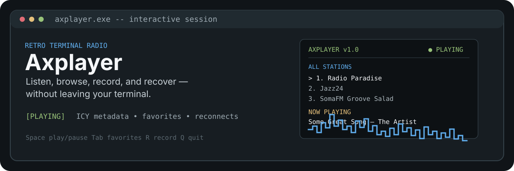
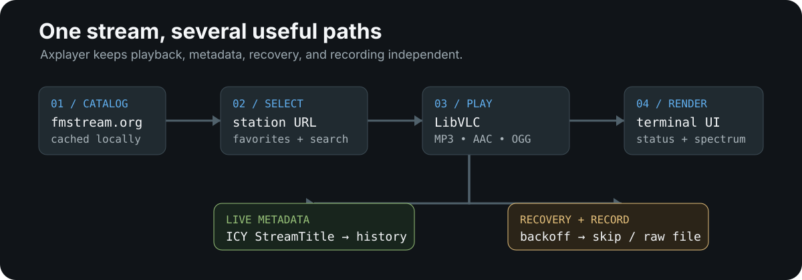

# Axplayer

> A keyboard-first internet radio player for Windows terminals.

Axplayer brings a full radio workflow into a retro terminal UI: browse categorized stations, play Icecast/Shoutcast streams, follow live song metadata, save favorites, record raw audio, and keep listening when a stream briefly drops.

<p align="center">
  
</p>

> The hero is a static SVG made from Axplayer’s real terminal vocabulary: station rows, playback state, ICY metadata, keyboard controls, and spectrum bars.

<p align="center">
  
</p>

## Why Axplayer?

- **Radio in, terminal out.** LibVLC handles MP3, AAC, OGG/Opus, and FLAC internet streams without a browser or WebView2 runtime.
- **Metadata that follows the stream.** Axplayer reads ICY `StreamTitle` blocks in real time and falls back to LibVLC metadata when a server does not expose ICY metadata.
- **A catalog that is useful on first launch.** Stations are fetched by genre from [fmstream.org](http://nossl.fmstream.org), cached locally, and replaced by a small built-in fallback when the directory is unavailable.
- **Designed for unreliable streams.** Playback runs through a local buffer: the stream is downloaded to a temp file and served back over localhost, so network blips never interrupt audio (VLC simply waits at the buffer edge) and the feed reconnects gap-free. A dropout longer than 2s triggers automatic reconnection for up to a 5-minute cover window, a configurable startup pre-roll buffers the stream before audio begins, and queue mode (`A`) auto-plays the next station when one dies while showing its position (for example `3/11`).
- **Your local radio library.** Favorites, imported stations, play counts, settings, logs, and recordings live under one `data/` directory. Automatic recording can run indefinitely, grouping each five-minute segment inside a timestamped session folder so long sessions stay organized. With buffered playback enabled, recording reads the same localhost buffer instead of opening a second radio connection.

<p align="center">
  
</p>

## Quick start

### Requirements

- Windows 10 or later
- [.NET SDK 10](https://dotnet.microsoft.com/download) or later
- Windows Terminal recommended for the best Unicode box-drawing and color support

### Run from source

```bash
dotnet run --project src/Axplayer
```

The first run starts with the bundled fallback stations while it refreshes the categorized catalog in the background. Press `Enter` on a station to play it.

### Build a portable executable

The repository includes a Windows build script that publishes a self-contained, single-file executable and detects x64/ARM64 automatically:

```bat
build.bat
```

For a clean rebuild:

```bat
build.bat -r
```

The executable is written to:

```text
src/Axplayer/bin/Release/net10.0/<rid>/publish/Axplayer.exe
```

To launch it as `axplayer` from a new terminal window, optionally add the publish directory to your user `PATH`:

```bat
add-to-path.bat
```

<p align="center">
  
</p>

## TUI controls

| Key | Action | Key | Action |
| --- | --- | --- | --- |
| `Space` / `P` | Play or pause selected station | `S` | Stop playback |
| `Enter` | Play selected station | `↑` / `↓` | Navigate stations |
| `Tab` | Switch all stations / favorites | `/` | Search by name or genre |
| `F` | Toggle favorite | `N` | Add a station |
| `E` | Edit station | `D` | Delete selected station |
| `Ctrl+D` | Delete all stations | `R` | Record / stop recording |
| `+` / `-` | Change volume | `M` | Mute / unmute |
| `I` | Show station info and history | `T` | Set sleep timer |
| `X` / `L` | Export / import favorites | `C` | Cycle theme |
| `Ctrl+R` | Refresh catalog | `Q` / `Esc` | Quit |
| `A` | Toggle queue mode — auto-plays the next station if one fails to connect | `B` | Set startup buffer seconds (pre-roll) |
| `J` | Manually skip/resume the next queue station | `G` | Toggle automatic recording |


## Command-line modes

Use the executable after publishing, or replace `Axplayer.exe` with `dotnet run --project src/Axplayer --` while developing.

```text
Axplayer.exe                         Launch the interactive TUI
Axplayer.exe --station <url>         Play a stream URL on startup
Axplayer.exe --volume <0-100>        Override the default volume
Axplayer.exe --no-visualizer         Hide the spectrum panel
Axplayer.exe --data-dir <path>       Store data somewhere else
Axplayer.exe --probe <url>            Validate a stream and print ICY information
Axplayer.exe --play-test <url>       Run a headless playback smoke test
Axplayer.exe --buffer-test <url>     Buffer-mode smoke test (buffer + play the local stream)
Axplayer.exe --seconds <3-120>       Set the --play-test/--buffer-test duration (default: 15)
Axplayer.exe --refresh-catalog        Refresh the station catalog, then exit
Axplayer.exe --catalog-url <url>     Use a different catalog base URL
Axplayer.exe --check                 Verify data files and LibVLC, then exit
Axplayer.exe --ui-preview            Render one sample TUI frame, then exit
Axplayer.exe --help                  Show all options
Axplayer.exe --version               Show the version
```

Useful checks after a build:

```bat
Axplayer.exe --check
Axplayer.exe --ui-preview
Axplayer.exe --probe https://example.com/stream
```

## How it works

```text
fmstream.org ── categorized fetch ──┐
                                    v
                              stations.json ──> station list / favorites
                                                     │
                                      selected URL ──┼──> LibVLC audio playback
                                                     ├──> ICY metadata reader ──> now playing
                                                     ├──> stall watchdog ──> reconnect / queue
                                                     └──> raw stream recorder ──> data/recordings/
```

The UI is rendered as a single ANSI frame by Spectre.Console. Playback is isolated behind an `IAudioPlayer` abstraction, while the station repository owns persistence, catalog refresh, favorites, imports, and exports.

## Data and files

Axplayer creates its runtime data next to the executable unless `--data-dir` is supplied:

```text
data/
├── settings.json       # volume, theme, last station, buffer, queue, recording and network settings
├── stations.json       # catalog, custom stations, favorites and play counts
├── favorites.txt       # default export/import target for favorites
├── logs/               # timestamped diagnostics
└── recordings/         # timestamped session folders containing recording segments
```

The single-file publish embeds the LibVLC runtime and extracts native components to a temporary directory on first launch. A normal framework-dependent run uses the restored NuGet assets instead.

## Project layout

```text
src/Axplayer/
├── Program.cs                 # CLI parsing, help, probes, smoke tests and self-check
├── App.cs                     # application state, input, playback and reconnect loop
├── Audio/
│   ├── LibVlcPlayer.cs        # LibVLC playback backend
│   ├── StreamBuffer.cs        # local buffered playback and dropout recovery
│   ├── StreamProbe.cs         # URL validation and stream headers
│   └── IcyMetadataReader.cs   # live StreamTitle parsing
├── Config/                    # settings model and JSON persistence
├── Data/
│   ├── StationRepository.cs   # station storage, favorites and catalog refresh
│   └── FmstreamCatalog.cs     # categorized fmstream.org loader
├── Recording/                 # raw stream recording
└── UI/
    ├── MainLayout.cs          # complete frame composition
    ├── StationListView.cs     # station rows and selection
    ├── NowPlayingBar.cs       # playback metadata and status
    └── Visualizer.cs          # procedural terminal spectrum display
```

## Known limits

- The visualizer is **procedurally simulated**, not decoded PCM. LibVLC plays the audio internally, and this console app does not receive sample data for the bars.
- Live titles depend on server metadata. A stream must honor `Icy-MetaData: 1`; otherwise Axplayer uses LibVLC metadata when available or displays no title.
- Catalog refresh depends on fmstream.org. Requests are rate-gated and retried with backoff; the cached list is retained if refresh fails.
- Recordings contain raw stream bytes without transcoding. In buffered mode they are copied from the shared local stream, avoiding a second network connection. Each recording session gets a timestamped folder, and long sessions are split into five-minute segments inside it. The file extension is inferred from the stream’s likely format.
- The interactive UI requires a real keyboard terminal; use `--probe`, `--play-test`, `--check`, or `--ui-preview` for non-interactive diagnostics.

## License

No license file is currently included in this repository. Add a `LICENSE` file before distributing Axplayer so reuse terms are explicit.
